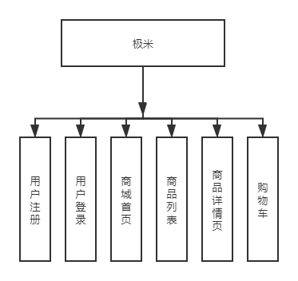

# xgimi

基于jquery+gulp

## 仿极米官网开发
### 1.项目流程
首页，登录，注册，列表页，详情页，购物车

 

### 2.项目效果
放大镜效果，飞入购物车效果，缩略图滚动，banner轮播图，表单验证
### 3.项目技术
jquery+mysql+php+html+css+js

### 4.项目的一些说明

> play -> 数据库，项目结构图
>
> php->php文件
>
> dist->线上目录
>
> src->开发目录
>
> .gitigonre->忽略文件
>
> gulpfile.js->gulp文件
>
> package.json->项目依赖包

